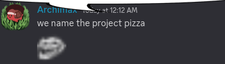

# Mozzarella

A utility and customization script for ChromeOS's Crostini VM, as well as a tutorial on how to install other Linux distributions instead of Debian.

# Why the name?
**Mozzarella is a popular topping for crostini that makes it taste better.** 

However, this does not mean it was the only name idea we had. Archimax couldn't find ASCII art of mozzarella cheese, only pizza, leading to this bright idea.

# Credits
Sophie - Making the scripts, ascii, and icon

Archimax - Cleaning up and formatting the scripts
