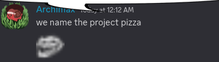

# Mozzarella

A utility and customization script for ChromeOS's Crostini VM.

# Why the name?
**Mozzarella is a popular topping for crostini that makes it taste better.** 

However, this does not mean it was the only name idea we had. Archimax couldn't find ASCII art of mozzarella cheese, only pizza, leading to this bright idea.

# Credits
- [Sophie](https://github.com/sophiaasophieee) - Pioneering this wild script & made OS.md
- [xmb9](https://github.com/EnterTheVoid-x86) - Cleaning up and formatting the scripts
